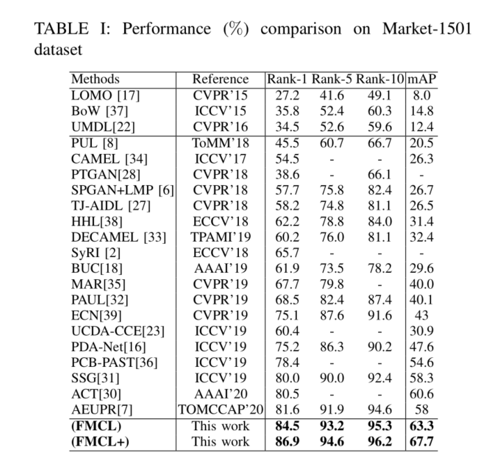

## [Fast  Momentum Contrast Learning for Unsupervised Person Re-Identification]


### Preparation

#### Requirements: Python=3.6 and Pytorch>=1.0.0

1. Install [Pytorch](http://pytorch.org/) opencv

2. Download dataset

   - Market-1501 [[BaiduYun]](http://pan.baidu.com/s/1ntIi2Op) [[GoogleDriver]](https://drive.google.com/file/d/0B8-rUzbwVRk0c054eEozWG9COHM/view?usp=sharing) CamStyle (generated by CycleGAN) [[GoogleDriver]](https://drive.google.com/open?id=1klY3nBS2sD4pxcyUbSlhtfTk9ButMNW1) [[BaiduYun]](https://pan.baidu.com/s/1NHv1UfI9bKo1XrDx8g70ow) (password: 6bu4)
   
   - DukeMTMC-reID [[BaiduYun]](https://pan.baidu.com/s/1jS0XM7Var5nQGcbf9xUztw) (password: bhbh) [[GoogleDriver]](https://drive.google.com/open?id=1jjE85dRCMOgRtvJ5RQV9-Afs-2_5dY3O) CamStyle (generated by CycleGAN) [[GoogleDriver]](https://drive.google.com/open?id=1tNc-7C3mpSFa_xOti2PmUVXTEiqmJlUI) [[BaiduYun]](https://pan.baidu.com/s/1NHv1UfI9bKo1XrDx8g70ow) (password: 6bu4)
   
   
   Ensure the File structure is as follow:
   
   ```
   FMCL/data    
   │
   └───market OR duke OR msmt17
      │   
      └───bounding_box_train
      │   
      └───bounding_box_test
      │   
      └───bounding_box_train_camstyle
      | 
      └───query
   ```

### Training and test domain adaptation model for person re-ID

  ```Shell
  train:（the training code coming soon）
  # For Duke to Market-1501
  python main.py -s duke  -t market    --logs-dir logs/duke2market-ECN --batch-size 128 --dropout 0.4 --lmd 0.7 --knn 18 --inv-beta 0.07 
  # For Market-1501 to Duke
  python main.py -s market  -t duke    --logs-dir logs/market2duke-ECN --batch-size 128 --dropout 0.4 --lmd 0.7 --knn 18 --inv-beta 0.07 
  test:
   # For Duke to Market-1501
  python test.py -s duke  -t market    --logs-dir logs/duke2market-ECN --batch-size 128 --dropout 0.4 --lmd 0.7 --knn 18 --inv-beta 0.07  
  # For Market-1501 to Duke
  python test.py -s market  -t duke    --logs-dir logs/market2duke-ECN --batch-size 128 --dropout 0.4 --lmd 0.7 --knn 18 --inv-beta 0.07 
 

### Results

 


       
### References

- [1] Our code is conducted based on [ECN](https://github.com/zhunzhong07/ECN)

- [2] Invariance Matters: Exemplar Memory for Domain Adaptive Person Re-identification. CVPR 2019.

- [3] Momentum Contrast for Unsupervised Visual Representation Learning. 


    


# FMCL_UDA
36ca7cb50bbb68685bd54d74c5b46c55cc7b1c03
